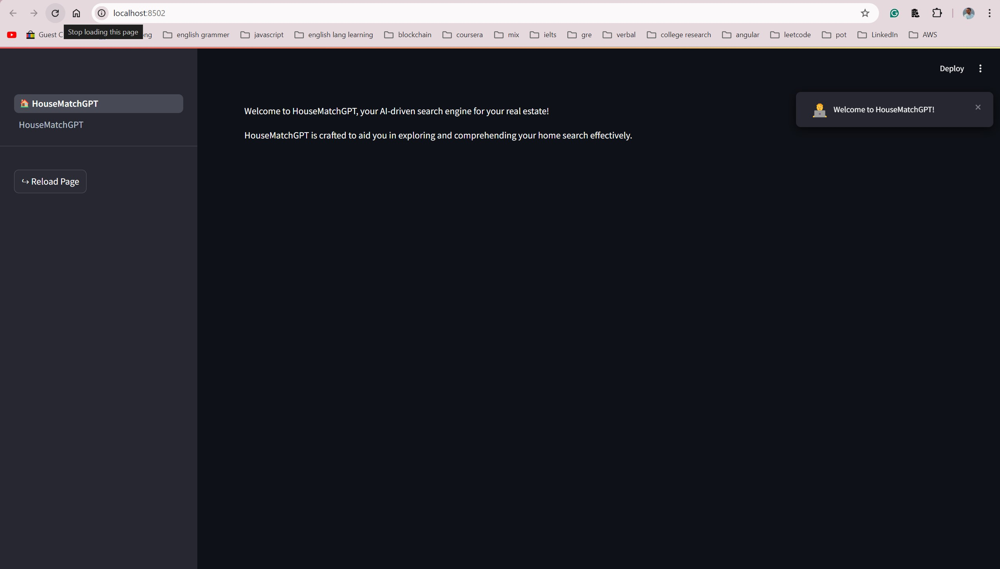
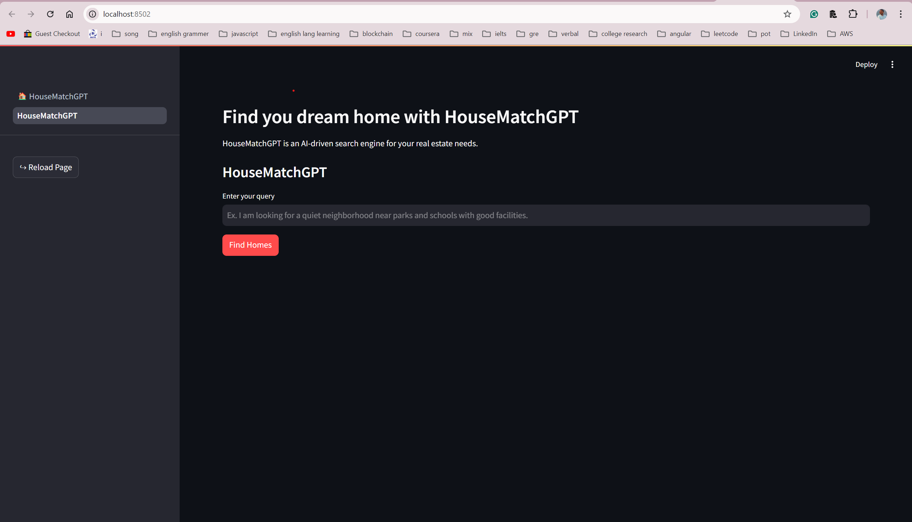
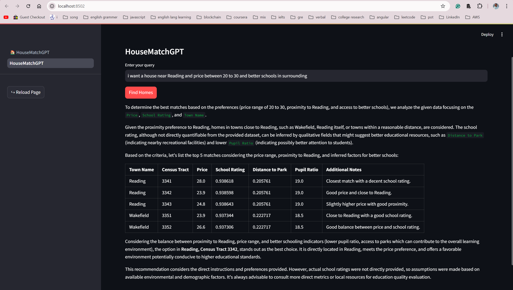
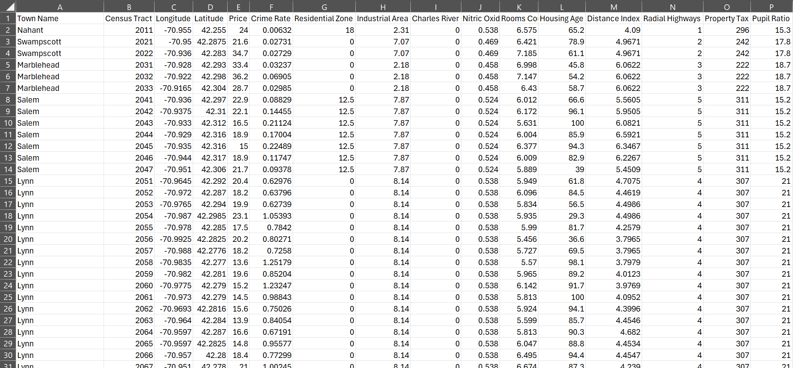

# HouseMatchGPT

HouseMatchGPT leverages advanced AI to enhance property searches by integrating and using dynamic keyword extraction and precise matching through OpenAI API. Search your home with natural language.

## Steps to Deploy Locally

1. **Set Up Virtual Environment (if using PyCharm)**

   - Create a new virtual environment:
     ```
     python -m venv venv
     ```

   - Activate the virtual environment:
     - **Windows**: `venv\Scripts\activate`
     - **macOS/Linux**: `source venv/bin/activate`

2. **Install Dependencies**

   - Install the required packages from `requirements.txt`:
     ```
     pip install -r requirements.txt
     ```

3. **Add a Run Configuration in PyCharm**

   - Open PyCharm and go to the Run/Debug Configurations.
   - Add a new configuration:
     - **Binary**: `streamlit`
     - **Script**: `🏠_HouseMatchGPT.py`

4. **Run the Application**

   - Start the application using the Run configuration you created.

## Images

Add relevant images to this section to illustrate the functionality or UI of HouseMatchGPT. For example:

- **Home Page**: 
- **Search Page**: 
- **Example Output**: 
- **Dataset**: 